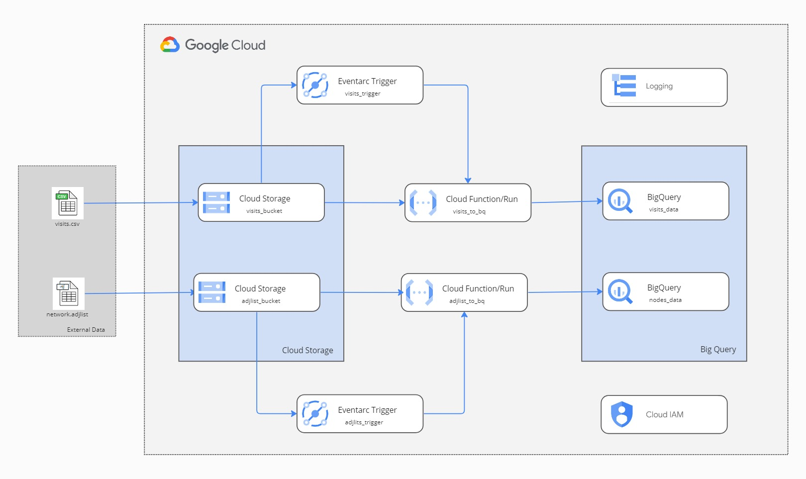

# Code repository for Cloud Functions

## Cloud Functions  'visits_to_bq'

This function is called from the trigger as soon as the file arrives in storage bucket which will receive visits info in
CSV format.

- Called from an Eventarc trigger.
- Load file from storage bucket
- Check if visits bq table exists, otherwise create using provided schema.
- Inserts the data from file to bq table.

## Cloud Functions  'adjlist_to_bq'

This function is called from the trigger as soon as the file arrives in storage bucket which will receive visits info in
CSV format.

- Called from an Eventarc trigger.
- Load file from storage bucket
- Check if visits bq table exists.
- If it does delete it. (Assuming that we get full not data each time.)
- Otherwise, create using provided schema.
- Inserts the data from file to bq table.