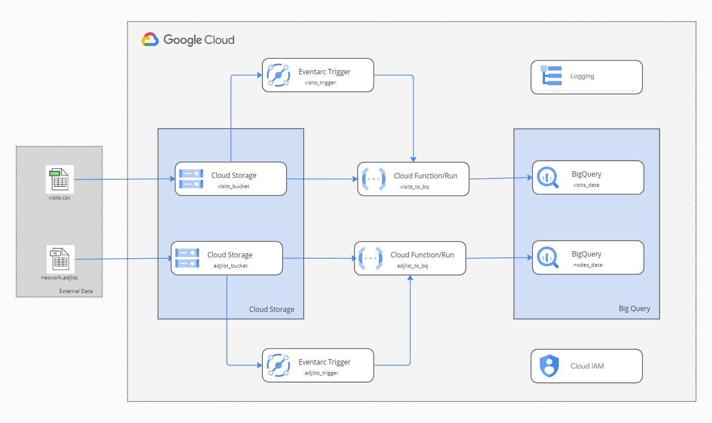

# Code repository for Cloud Function 'visits_to_bq'

This function is called from the trigger as soon as the file arrives in storage bucket which will receive visits info in
CSV format.

- Called from an Eventarc trigger.
- Load file from storage bucket
- Check if visits bq table exists, otherwise create using provided schema.
- Inserts the data from file to bq table.

## Repository

This repository contains the code for the Code repository for Cloud Function 'visits_to_bq'